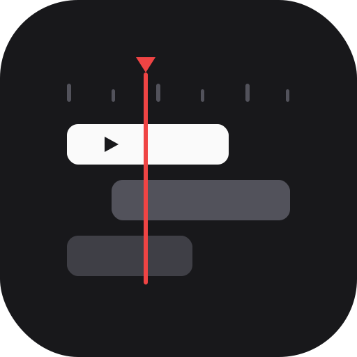

<p align="center">
  
</p>

<h1 align="center">@ariefsn/svelte-video-editor</h1>

<p align="center">
  <a href="https://www.npmjs.com/package/@ariefsn/svelte-video-editor"></a>
  <a href="https://www.npmjs.com/package/@ariefsn/svelte-video-editor"></a>
  <a href="https://bundlephobia.com/package/@ariefsn/svelte-video-editor"></a>
  
  
  <a href="./LICENSE"></a>
</p>

A host-agnostic, **Svelte 5** video timeline editor — a CapCut/Premiere-style timeline with
clips, tracks, trimming, ripple/roll/slip edits, grouping, linked audio, markers, in/out range,
undo/redo, and a real-time DOM preview. No framework lock-in: all external concerns (asset URLs,
thumbnails, export, permissions, persistence, notifications, confirmation, i18n) are injected by
the host.

- **The library owns no storage** — you persist the project (and pane height) however you like.
- **Tailwind v4 theming** — ships a simple light/dark theme you can override via CSS variables.

> ⚠️ **Browser-only.** This component renders in the browser (DOM, `<video>`/`<audio>`, canvas,
> `requestAnimationFrame`). It is safe to _import_ on the server, but render it client-side only
> (see [SvelteKit (SSR)](#sveltekit-ssr)).

- **Repo:** [https://github.com/ariefsn/svelte-video-editor](https://github.com/ariefsn/svelte-video-editor)

## Contents

- [Install](#install)
- [Theme](#theme)
- [Simple mode](#simple-mode) — props & callbacks only
- [Advanced mode](#advanced-mode) — snippets, i18n, host-owned state
- [SvelteKit (SSR)](#sveltekit-ssr)
- [Host contract](#host-contract)
- [Section overrides](#section-overrides-snippets)
- [Custom preview renderer](#custom-preview-renderer) — Remotion, canvas, anything
- [Localization](#localization)
- [License](#license)

## Install

```bash
bun add @ariefsn/svelte-video-editor
# or: npm i @ariefsn/svelte-video-editor
# or: pnpm add @ariefsn/svelte-video-editor
```

Requires `svelte@^5` and Tailwind v4 in your app.

## Theme

Import the shipped theme once (it defines the `--ts-*` CSS variables + light/dark palette):

```ts
// app.css or your root layout
import '@ariefsn/svelte-video-editor/app.css';
```

Dark mode follows a `.dark` class on an ancestor (e.g. `<html class="dark">`). Override any token
to restyle:

```css
:root {
	--ts-primary: hsl(220 90% 56%); /* your brand */
}
```

---

## Simple mode

The minimal "drop it in and go" setup — **props and callbacks only, no snippets**. You supply a
project, persist it in `onChange`, and resolve media. That's it.

```svelte
<script lang="ts">
	import { browser } from '$app/environment';
	import {
		TimelineEditor,
		createEmptyProject,
		migrateProject,
		type NotifyKind,
		type ResolvedAsset,
		type TimelineProject
	} from '@ariefsn/svelte-video-editor';
	import '@ariefsn/svelte-video-editor/app.css';

	// The host owns the project and its persistence. The library stores nothing.
	let project = $state<TimelineProject | null>(null);

	$effect(() => {
		if (!browser || project) return;
		const saved = localStorage.getItem('my-project');
		project = saved ? migrateProject(JSON.parse(saved)) : createEmptyProject('My first video');
	});

	function handleChange(p: TimelineProject) {
		project = p;
		localStorage.setItem('my-project', JSON.stringify(p)); // host-owned persistence
	}

	// Resolve a clip's media URL (+ metadata). Here URLs resolve to themselves.
	async function resolveAsset(assetId: string): Promise<ResolvedAsset> {
		return { url: assetId, hasAudio: true };
	}

	// Return a thumbnail image URL for `frame` (at a fixed 30fps reference).
	async function generateThumbnail(assetId: string, frame: number): Promise<string> {
		return assetId; // e.g. an  poster; real apps seek a <video> + canvas
	}

	function handleExport(p: TimelineProject) {
		console.log('export', p); // you own rendering
	}

	function handleNotify(message: string, kind: NotifyKind) {
		console.log(kind, message); // wire to your toast system if you like
	}
</script>

{#if browser && project}
	{#key project.id}
		<TimelineEditor
			{project}
			onChange={handleChange}
			{resolveAsset}
			{generateThumbnail}
			onExport={handleExport}
			can={() => true}
			onNotify={handleNotify}
		/>
	{/key}
{/if}
```

`onBack` is omitted here, so no back button renders.

---

## Advanced mode

Use snippets to customize sections, supply your own confirm dialog, switch languages at runtime,
gate features, and own the pane height — everything injected by the host.

```svelte
<script lang="ts">
	import { browser } from '$app/environment';
	import {
		TimelineEditor,
		InspectorPanel,
		createEmptyProject,
		uid,
		type BinItem,
		type ConfirmOptions,
		type EditorAction,
		type MessagesOverride,
		type ResolvedAsset,
		type SectionCtx,
		type TimelineProject
	} from '@ariefsn/svelte-video-editor';
	import '@ariefsn/svelte-video-editor/app.css';

	let project = $state<TimelineProject | null>(null);
	let timelineHeight = $state<number | undefined>(undefined);
	let lang = $state<'en' | 'id'>('en');
	let proTier = $state(true);

	$effect(() => {
		if (!browser || project) return;
		project = createEmptyProject('Advanced demo');
		timelineHeight = Number(localStorage.getItem('paneH')) || undefined;
	});

	async function resolveAsset(assetId: string): Promise<ResolvedAsset> {
		return { url: assetId, hasAudio: true };
	}
	async function generateThumbnail(assetId: string): Promise<string> {
		return assetId;
	}

	function handleChange(p: TimelineProject) {
		project = p;
	}

	function handleExport(p: TimelineProject) {
		console.log('export', p);
	}

	function handleHeight(h: number) {
		timelineHeight = h;
		localStorage.setItem('paneH', String(h)); // host-owned persistence
	}

	function canDo(action: EditorAction): boolean {
		return action === 'export' ? proTier : true;
	}

	// Localization is host-owned: swap the whole messages map to switch language.
	const messagesId: MessagesOverride = { export: 'Ekspor', split: 'Pisah', undo: 'Urungkan' };
	const messages = $derived<MessagesOverride | undefined>(lang === 'id' ? messagesId : undefined);

	// Use your OWN confirm dialog instead of the built-in one (optional).
	async function confirm(opts: ConfirmOptions): Promise<boolean> {
		return window.confirm(`${opts.title}\n\n${opts.message ?? ''}`);
	}

	let pasteUrl = $state('');
	function addByUrl(addItems: (items: BinItem[]) => void) {
		if (!pasteUrl.trim()) return;
		addItems([{ id: uid(), url: pasteUrl, name: 'media', mediaType: 'video', duration: null }]);
		pasteUrl = '';
	}
</script>

{#if browser && project}
	{#key project.id}
		<TimelineEditor
			{project}
			onChange={handleChange}
			{resolveAsset}
			{generateThumbnail}
			onExport={handleExport}
			can={canDo}
			{messages}
			{confirm}
			{timelineHeight}
			onTimelineHeightChange={handleHeight}
			onBack={() => history.back()}
		>
			<!-- Host-owned import UI inside the asset bin -->
			{#snippet binImport({ addItems })}
				<form
					onsubmit={(e) => {
						e.preventDefault();
						addByUrl(addItems);
					}}
				>
					<input bind:value={pasteUrl} placeholder="Paste media URL…" />
					<button>Add</button>
				</form>
			{/snippet}

			<!-- WRAP a default section: render the built-in + add your own UI -->
			{#snippet inspector(ctx: SectionCtx)}
				{#if ctx.editor.activeClip}
					<InspectorPanel onRequestDelete={ctx.onRequestDelete} />
				{/if}
				<div class="p-3 text-xs">Active clip: {ctx.editor.activeClip?.name ?? '—'}</div>
			{/snippet}

			<!-- FULLY REPLACE a section -->
			{#snippet shortcutsFooter()}
				<div class="border-t px-3 py-1 text-xs">My custom footer</div>
			{/snippet}
		</TimelineEditor>
	{/key}
{/if}
```

Switch `lang` between `'en'` and `'id'` at runtime and the whole UI re-labels reactively — no
`locale` prop, the `messages` map is the single source of translation.

> A runnable version of both modes lives in this repo under `src/routes/` (`/` = simple,
> `/advanced` = advanced). Run `bun run dev`.

---

## SvelteKit (SSR)

SvelteKit is SSR by default and the editor needs the DOM — render it under a browser guard:

```svelte
<script lang="ts">
	import { browser } from '$app/environment';
	import { TimelineEditor } from '@ariefsn/svelte-video-editor';
</script>

{#if browser}
	<TimelineEditor … />
{/if}
```

(Or set `export const ssr = false` on the route.)

---

## Host contract

| Prop                                        | Type                                  | Required | Notes                                                                               |
| ------------------------------------------- | ------------------------------------- | -------- | ----------------------------------------------------------------------------------- |
| `project`                                   | `TimelineProject`                     | ✅       | Auto-migrated from older shapes. Remount via `{#key project.id}` to switch.         |
| `onChange`                                  | `(project) => void`                   | ✅       | Debounced (`changeDebounceMs`, default 800ms; `0` = immediate). **You persist it.** |
| `resolveAsset`                              | `(assetId) => Promise<ResolvedAsset>` | ✅       | Resolve media URL + metadata.                                                       |
| `generateThumbnail`                         | `(assetId, frame) => Promise<string>` | ✅       | `frame` at a fixed 30fps reference.                                                 |
| `onExport`                                  | `(project, range?) => void`           | ✅       | You own rendering/export.                                                           |
| `can`                                       | `(action) => boolean`                 | ✅       | Permission gate (`'export'`, `'magnetic-main-track'`).                              |
| `onBack`                                    | `() => void`                          | ❌       | Back button renders only when provided.                                             |
| `onNotify`                                  | `(message, kind) => void`             | ❌       | Transient feedback sink; no-ops if absent.                                          |
| `messages`                                  | `Partial<Messages>`                   | ❌       | Override/translate any label (the single i18n source).                              |
| `confirm`                                   | `(opts) => Promise<boolean>`          | ❌       | Use your own confirm dialog instead of the built-in.                                |
| `timelineHeight` / `onTimelineHeightChange` | `number` / `(h) => void`              | ❌       | Host-owned pane height.                                                             |
| `magneticMainTrack`                         | `boolean`                             | ❌       | CapCut-style packing on the first track.                                            |
| `changeDebounceMs`                          | `number`                              | ❌       | Debounce for `onChange`.                                                            |

`ProjectListView` is also exported for a "pick/create a project" screen (`projects`, `onOpen`,
`onCreate`, `onRename`, `onDelete`, plus optional `messages` / `confirm`).

## Section overrides (snippets)

Replace any section via a snippet receiving `SectionCtx` (`{ editor, host, onBack?, onRequestDelete }`):
`toolbar`, `assetBin`, `preview`, `transport`, `inspector`, `tracks`, `shortcutsFooter`, plus
`binImport` (host import UI, gets `{ addItems }`). You can **wrap** a default by rendering the
exported section component (e.g. `<TimelineToolbar {...ctx} />`) and adding your own UI around it.

## Custom preview renderer

**Yes — you can replace the preview entirely** (Remotion, a canvas player, a WebGL compositor,
anything). The built-in `PreviewStage` is just the default; pass a `preview` snippet and the
editor renders yours instead. There are **two separate surfaces** to consider:

| Surface                                | Override                    | What it is                                      |
| -------------------------------------- | --------------------------- | ----------------------------------------------- |
| **Live preview** (in-editor scrubbing) | `preview` snippet           | Real-time playback while editing.               |
| **Final render** (export)              | `onExport(project, range?)` | You already own this — render however you like. |

### What the `preview` snippet gives you

The snippet receives the same `SectionCtx` as every section override:

```svelte
<script lang="ts">
	import { TimelineEditor, type SectionCtx } from '@ariefsn/svelte-video-editor';
</script>

<TimelineEditor {project} {onChange} {resolveAsset} {generateThumbnail} {onExport} {can}>
	{#snippet preview(ctx)}
		<!-- ctx.editor.project   — full reactive timeline (tracks, clips, fps, aspectRatio) -->
		<!-- ctx.editor.playhead  — current position, in seconds -->
		<!-- ctx.editor.playing   — boolean play/pause state -->
		<!-- ctx.host.resolveAsset — (assetId) => Promise<ResolvedAsset> for media URLs -->
		<MyRenderer
			project={ctx.editor.project}
			playhead={ctx.editor.playhead}
			playing={ctx.editor.playing}
			resolveAsset={ctx.host.resolveAsset}
		/>
	{/snippet}
</TimelineEditor>
```

All the data types your renderer needs (`TimelineProject`, `MediaClip`, `TextClip`,
`TimelineTrack`, `frameToSec`, `secToFrame`, `isMediaClip`, `isTextClip`, …) are exported from
the package.

### Using Remotion specifically

Remotion works, but it's **host-owned glue** — the library gives you the seam and the data, not
a drop-in Remotion player. There are two things to bridge:

1. **React ↔ Svelte.** Remotion's `<Player>` is a React component and this is Svelte 5, so you
   mount a small React island (`createRoot`) inside a Svelte wrapper.
2. **Playback.** The built-in `PlaybackEngine` only drives the native `<video>`/`<audio>`
   elements in `PreviewStage` — it does **not** drive Remotion. You sync the editor store and the
   Player's `playerRef` to each other yourself, in **both** directions.

The store API you wire against (all reactive, exported types):

| Read from editor  | Meaning                         | Call on editor (when user scrubs _inside_ the Player)      |
| ----------------- | ------------------------------- | ---------------------------------------------------------- |
| `editor.playhead` | current time, **float seconds** | `editor.seek(seconds)` / `editor.seekFrame(frame)`         |
| `editor.playing`  | boolean                         | `editor.play()` / `editor.pause()` / `editor.togglePlay()` |
| `editor.fps`      | project fps (int)               | —                                                          |
| `editor.project`  | full `TimelineProject`          | —                                                          |

#### Bridge component (`RemotionPreview.svelte`)

```svelte
<script lang="ts">
	import { onMount, onDestroy } from 'svelte';
	import { createRoot, type Root } from 'react-dom/client';
	import { createElement } from 'react';
	import { Player, type PlayerRef } from '@remotion/player';
	import { secToFrame, type SectionCtx } from '@ariefsn/svelte-video-editor';
	import { MyComposition } from './MyComposition'; // your Remotion composition (React)

	// Passed straight from the preview snippet: <RemotionPreview {ctx} />
	let { ctx }: { ctx: SectionCtx } = $props();
	const editor = ctx.editor;

	let mountEl: HTMLDivElement;
	let root: Root;
	let player: PlayerRef | null = null;
	// Suppress the echo when an editor→player seek triggers the player's own event.
	let applying = false;

	// 16:9 / 9:16 / 1:1 → pixel dims (host's choice). aspectRatio has no width/height.
	const dims = $derived(
		{ '16:9': [1920, 1080], '9:16': [1080, 1920], '1:1': [1080, 1080] }[editor.project.aspectRatio]
	);

	onMount(() => {
		root = createRoot(mountEl);
		renderPlayer();
	});
	onDestroy(() => root?.unmount());

	function renderPlayer() {
		root.render(
			createElement(Player, {
				ref: (r: PlayerRef | null) => (player = r),
				component: MyComposition,
				// Map clips/tracks + resolveAsset into your composition's props:
				inputProps: { project: editor.project, resolveAsset: ctx.host.resolveAsset },
				durationInFrames: Math.max(1, secToFrame(editor.duration, editor.fps)),
				compositionWidth: dims[0],
				compositionHeight: dims[1],
				fps: editor.fps,
				controls: false, // the editor's TransportBar already drives playback
				style: { width: '100%', height: '100%' }
			})
		);
	}

	// Re-render the Player when the timeline/aspect changes.
	$effect(() => {
		void editor.project; // re-run on project edits
		if (root) renderPlayer();
	});

	// editor → player: keep the Player's frame + play state in sync with the store.
	$effect(() => {
		if (!player) return;
		const frame = secToFrame(editor.playhead, editor.fps);
		if (player.getCurrentFrame() !== frame) {
			applying = true;
			player.seekTo(frame);
			applying = false;
		}
		if (editor.playing && player.isPlaying() === false) player.play();
		if (!editor.playing && player.isPlaying()) player.pause();
	});

	// player → editor: when the user scrubs/plays inside the Player, push it back.
	$effect(() => {
		if (!player) return;
		const onSeek = (e: { detail: { frame: number } }) => {
			if (applying) return; // ignore our own seekTo
			editor.seekFrame(e.detail.frame);
		};
		const onPlay = () => editor.play();
		const onPause = () => editor.pause();
		player.addEventListener('seeked', onSeek);
		player.addEventListener('play', onPlay);
		player.addEventListener('pause', onPause);
		return () => {
			player?.removeEventListener('seeked', onSeek);
			player?.removeEventListener('play', onPlay);
			player?.removeEventListener('pause', onPause);
		};
	});
</script>

<div bind:this={mountEl} class="h-full w-full"></div>
```

Then drop it into the `preview` snippet:

```svelte
<TimelineEditor {project} {onChange} {resolveAsset} {generateThumbnail} {onExport} {can}>
	{#snippet preview(ctx)}
		<RemotionPreview {ctx} />
	{/snippet}
</TimelineEditor>
```

> **The `applying` guard matters.** Without it, an editor→player `seekTo` fires the Player's
> `seeked` event, which calls `editor.seekFrame`, which re-runs the editor→player effect — an
> infinite ping-pong. Gate one direction (here, the player→editor push ignores seeks we
> initiated).

#### Mapping the timeline into a composition

Inside `MyComposition` (your React code), turn the project data into Remotion `<Sequence>`s:

- `project.tracks` — **array order is z-order** (index 0 is the bottom layer).
- `project.clips` — each has `startF` (start frame), `durationF`, `trimInF` (source-in frame).
  Wrap each in `<Sequence from={startF} durationInFrames={durationF}>`.
- Media URLs — call `resolveAsset(clip.assetId)` (passed via `inputProps`) and feed the result
  to `<OffthreadVideo>` / `` / `<Audio>`. Use `isMediaClip` / `isTextClip` to branch;
  `TextClip.style` carries position/font as percentages of the stage.
- `project.aspectRatio` is `'16:9' | '9:16' | '1:1'` — there are **no** width/height fields, so
  pick pixel dims yourself (as `dims` above).

> **Simpler path:** if you only want Remotion for high-fidelity _output_ (not live scrubbing),
> skip the `preview` snippet entirely and keep the built-in `PreviewStage`. Just feed `project`
> into a Remotion render inside `onExport(project, range?)` — no React island, no sync glue.

## Localization

There is no `locale` prop — pass a fully-translated `messages` map. **`messages` is fully typed**, so
you get autocomplete for every key and a compile error on typos:

```ts
import type { Messages } from '@ariefsn/svelte-video-editor';
import { defaultMessages } from '@ariefsn/svelte-video-editor';

// Partial override — every key autocompletes:
const messages: Partial<Messages> = {
	export: 'Render',
	split: 'Cut',
	// most keys are strings; a few interpolate and are functions:
	delete_clips_confirm: ({ count }) => `Delete ${count} clip(s)?`
};
```

```svelte
<!-- `messages` is typed as Partial<Messages> -> IntelliSense lists all keys -->
<TimelineEditor messages={{ export: 'Render', split: 'Cut' }} … />
```

Exports for typing/translating:

- **`Messages`** — the full message map type (all keys; strings + the 4 interpolating functions).
- **`MessagesOverride`** = `Partial<Messages>` — the type of the `messages` prop.
- **`MessageKey`** — a union of every key name.
- **`defaultMessages`** — the English defaults (clone it as a base for a full translation).

Swap the whole `messages` object at runtime to switch languages reactively.

---

## License

MIT © [Arief Setiyo Nugroho](https://github.com/ariefsn) — [me@ariefsn.dev](mailto:me@ariefsn.dev)

See [LICENSE](./LICENSE).
